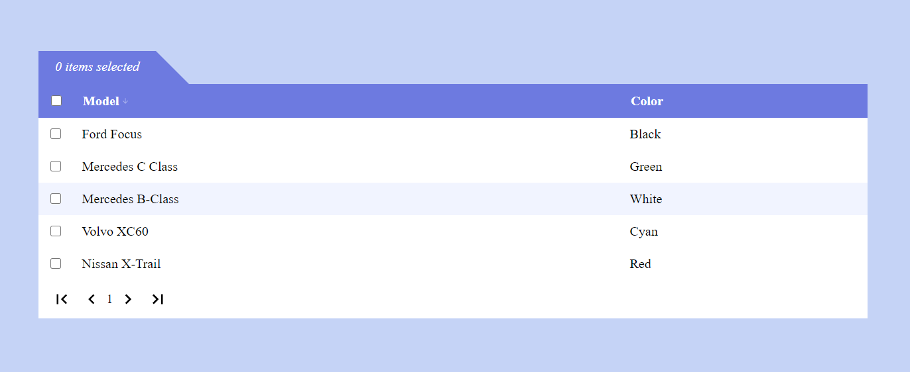
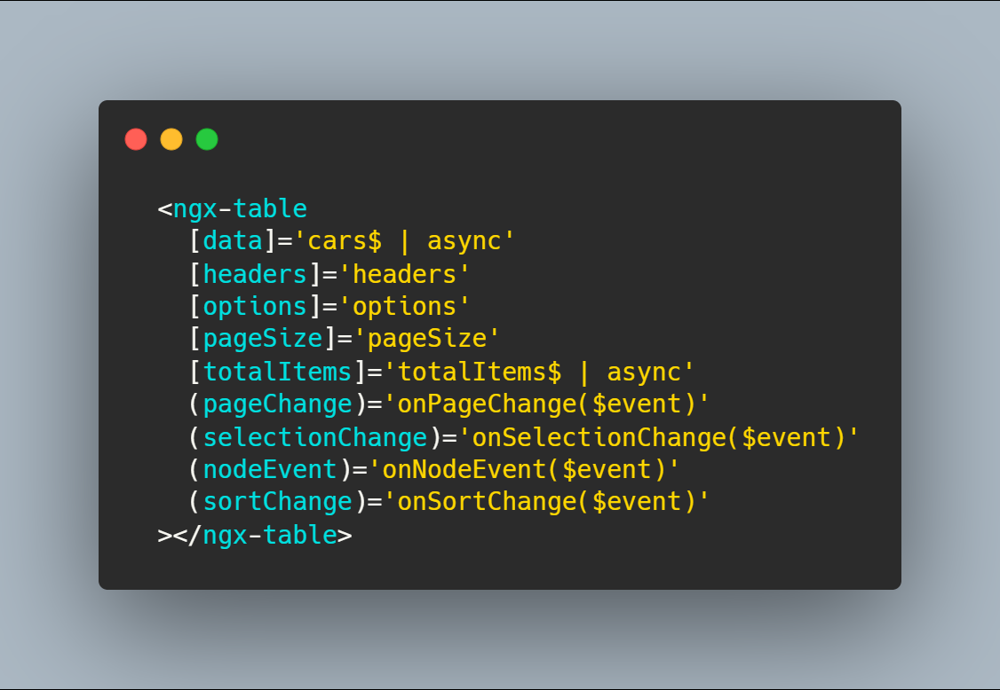

# ngx-component-cell-table
### Angular table with component nodes

## Install

Run `npm i ngx-component-cell-table` to install. 

## Usage

[Stackblitz](https://stackblitz.com/edit/angular-gfxr7d) live example.

